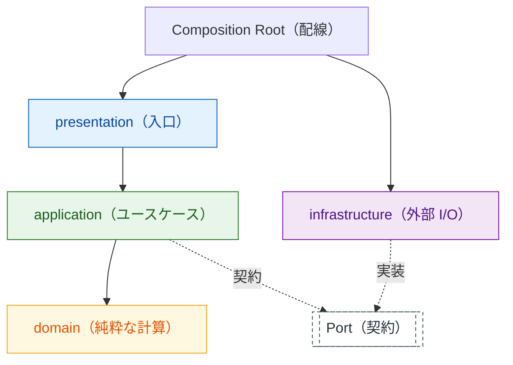

# {プロジェクト名} —— アーキテクチャ

> **「なぜこの構造なのか」「新しいものをどこに置けばいいのか」に
> 答えるための 1 枚。**
>
> **層の一覧（パスと import 規則）は書かない。**
> それは `CLAUDE.md` の「層構成」表が唯一の正で、ここに複写すると
> 二重管理になり、ずれた瞬間にどちらも信用できなくなる。
> ここに書くのは **理由・図・技術選定** だけ。
>
> 骨組みの時点では **図を 1 枚 ＋ 決めた理由 3 行** で十分。
> 判断が増えたときだけ追記する（反復のたびには触らない）。

**層の一覧とパス**: [CLAUDE.md の「層構成」節](../CLAUDE.md) が正
**層と契約の一般規約**: `.claude/skills/layered-architecture/SKILL.md` が正

## 層と依存の向き

依存の向きを 図 1 に示す。 **内向きの一方向だけ** で、逆流と循環は無い。



図 1: 層と依存の向き（実線 = 直接の依存、破線 = 契約経由）

<!--
  この図は実装から逆生成できる。書いたら突き合わせる:
    <ツール実行コマンド> .claude/tools/build_arch.py <ソースルート>
    <ツール実行コマンド> .claude/tools/diff_arch.py <ソースルート>
  図の色と向きの規約は writing-conventions/guides/diagrams.md が正。
-->

## なぜこの層構成にしたか

> **結論だけ書かない。** 他にどうできたか、それを採らなかった理由まで書く。

- **採用**: {決めた形}。**そう考えた理由**: {何を重く見たか}
- **他の選択肢**: {案B: 例 層を分けず 1 ファイルで始める} ／
  {案C: 例 フレームワークの標準構成に従う}
- **メリット / デメリット**: 採用案 = {得たもの} / {捨てたもの}。
  案B = {得られたはずのもの} / {避けたかったもの}

## 契約（Port）の方針

> **切らないと決めた線引きこそ書く。** 実装 1 つに 1 対 1 の
> インタフェースを作るのは意味の無い中間層で、それを禁じている理由が
> ここに無いと、次に触る人が「丁寧のつもり」で増やしてしまう。

| 契約にする | 契約にしない |
|---|---|
| {例: ファイル読み書き・時刻・乱数・外部通信} | {例: 純粋な計算・変換・判定} |

- **今ある契約**: {Port 名}（{何を抽象化しているか}）—— 実装は {どこ}
- **切らなかったもの**: {例: 設定の読み込みは 1 か所でしか使わないので切らない}

## 技術選定

> ライブラリ 1 つにつき 1 行。 **「なぜ選んだか」より
> 「何を捨てたか」のほうが後で効く** 。

| ライブラリ・道具 | 置く層 | なぜ選んだか | 何を捨てたか |
|---|---|---|---|
| {名前} | {層} | {決め手 1 つ} | {採らなかった選択肢と、そのとき諦めたもの} |

**外部ライブラリを domain に入れない**（純粋さが崩れるとテストが遅くなる）。
例外を作るときは、この表に理由を書いてから入れる。

## 配線（Composition Root）

- **場所**: `{パス}`
- **ここだけが全部を知ってよい。** 他の層は実装を直接 import しない
- **テストでの差し替え**: {フェイク実装をどこに置き、どう注入するか}

## 守られているか確かめる

```
<ツール実行コマンド> .claude/tools/diff_arch.py <ソースルート>
```

- 設計（この図）と実装の乖離を色分けして出す（正: `architecture-drift`）
- {アーキテクチャテストのコマンド。未導入なら「未導入」と書く}

**L3 では乖離 0 件・逆流 0 件が完了条件。** L1・L2 では
乖離が出てよいが、 **出たことを負債表に記録する** 。
