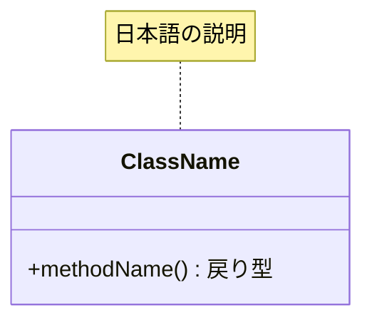

# {NN}. {レイヤー名} 層の設計

> 新しいレイヤー文書（または大きな節）を追加するときの構成テンプレート。
> 既存文書の更新では既存構造を維持すること。

## 責務

{この層が持つ責務を3〜5行で。持たない責務（他層に委譲するもの）も明記}

## 主要クラスと責務一覧

| クラス | 責務 | 備考 |
|---|---|---|
| `{ClassName}`（{日本語の意味}） | {責務} | {契約/実装/デコレータ等} |

## 構造（クラス図 / コンポーネント図）

> 図中の `ClassName` `methodName` は実物の名前に置き換える。
> `{}` を使わないのは、mermaid が波括弧をブロック構文として解釈し、
> 図検証ツールで構文エラーになるため。

## 主要フロー（シーケンス図 / フローチャート）

{この層の代表的な処理の流れを1〜2枚。詳細は該当フェーズの設計書へリンク}

## 設計上の決定

| 決定 | 理由 |
|---|---|
| {決定事項} | {理由。経緯の詳細は設計書 P## へのリンク} |
