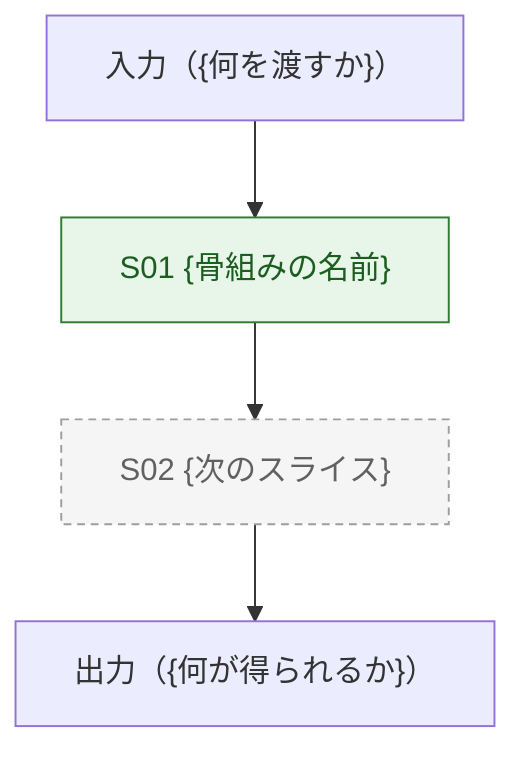

# {プロジェクト名} —— 全体像

> **「このシステムは何をするのか」に 1 分で答えるための 1 枚。**
> 層の話は書かない（`docs/architecture.md` の担当）。
> 判断の経緯も書かない（各機能設計書の「判断の記録」の担当）。
> 進捗も書かない（`docs/backlog.md` が正）。
>
> 骨組みの時点では **図を 1 枚 ＋ 10 行** で十分。育てるのは反復のたびに 1 行ずつ。

**ゴール**: {`docs/concept.md` から 1 文}

## 何をするものか

{何を入れると何が出るシステムなのかを 2〜3 行。専門用語を使わずに書く}

## 全体の流れ

入口から出口までの経路を 図 1 に示す。

> **ノードはスライス（S##）。層ではない。**
> 利用者が「どこを通って結果が出るのか」を追えることが目的。

図 1: 全体の流れ（実線 = 実装済み、破線の枠 = 未着手）

<!--
  ノード id はスライス番号（s01 / s02 …）。表示名は日本語。
  未着手のスライスも描く —— 「まだ無い」ことが見えるのが価値。
  書いたら構文検証する:
    powershell -File .claude/tools/check_diagrams.ps1 -Path docs/design.md
-->

## 今あるもの

| S## | 何をするか（1 行） | 成熟度 | 設計書 |
|---|---|---|---|
| S01 | {骨組みが通す 1 本の経路} | `L1 動く` | [S01](design/S01-{name}.md) |

> 成熟度は `docs/backlog.md` からの写し。 **食い違ったらバックログが正** 。
> ここを更新し忘れても進捗管理は壊れない（そのための一方向の写し）。

## 外から見た入口

> 利用者が実際に触れる面だけ。内部の関数は書かない。

| 入口 | 何が起きるか |
|---|---|
| `{コマンドや API}` | {観測できる結果} |

## 今ないもの（意図的に）

> **「なぜこれが無いのか」を毎回説明しなくて済むようにする欄。**
> やらないと決めたことは、失敗ではなく判断。

- {今回のゴールに入れていないもの}（理由: {1 行}）

## 関連

- 層と技術選定の理由: [docs/architecture.md](architecture.md)
- 進捗と負債: [docs/backlog.md](backlog.md)
- 使い方: [docs/manual.md](manual.md)
