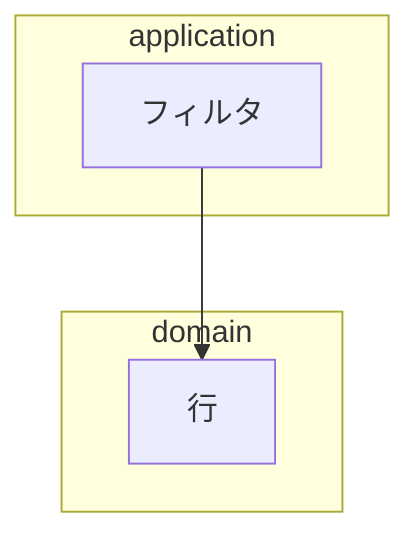

# アーキテクチャ乖離スキル（architecture-drift）

設計書の図は **「こうしたい」** 、実装は **「こうなっている」** 。
この 2 つは放っておくと必ずずれる。しかも **ずれた瞬間には誰も気づかない**
（動くから）。気づくのは、変更が異様に高くつくようになった後です。

このスキルは、ずれを **色** で見えるようにします。

## 3 種類の差（意味が全部違う）

| 差 | 図での見え方 | 意味 | どうするか |
|---|---|---|---|
| 一致 | 実線 | 設計どおり | なし |
| **設計にだけある** | 破線（灰） | まだ実装していない | 実装する / 設計から落とす |
| **実装にだけある** | 太線（黄） | **設計に無い構造が増えた** | 設計書に書く / 実装を戻す |
| **逆流** | 二重線（赤） | 内向きでない依存 | 直す（L3 の条件） |

**一番危険なのは黄色（実装にだけある）** 。
これは「AI が黙って増やした構造」であり、人が追いつけなくなる最大の原因です。
灰（未実装）は予定どおりのことも多く、緊急度は低い。

## 図のノード id は機械可読にする（この規約が前提）

比較が成立するのは、設計書の図と生成した図が **同じ id** を使うときだけです。



- **id はソースルート相対のモジュールパス**（`application.filter`）。
  拡張子なし、区切りは `.`
- **表示名（`[...]` の中）は日本語でよい** —— 人が読むのはこちら
- `subgraph` は層の名前（`presentation` / `application` / `domain` /
  `infrastructure`）

id が規約どおりでない図は、比較すると全部「設計にだけある（未実装）」に
倒れます。 **差分を見れば規約違反にも気づける** ので、別の検査は要りません。

## 成熟度ごとにどこまで許すか

| 目標 | 逆流 | 実装にだけある依存 | 未実装 |
|---|---|---|---|
| L1 動く | 記録すれば可（負債表へ） | 記録すれば可 | 可（設計が先行しているだけ） |
| L2 固い | **0 件** | 3 本まで（負債に記録） | 可 |
| L3 整った | **0 件** | **0 件** | **0 件**（設計書を実物に合わせる） |

**L1 で乖離を 0 にしようとしない。** 骨組みは通すことが優先で、
乖離の記録さえあれば L2 で返せます（記録されない乖離だけが規約違反）。

## 使い方

前置コマンドはプロファイルの「`.claude/tools/` の Python ツール実行」、
ソースルートはプロファイルの「ディレクトリ構成」を使う（推測しない）。

```
<ツール実行コマンド> .claude/tools/build_arch.py <ソースルート>   # 実物の図
<ツール実行コマンド> .claude/tools/diff_arch.py  <ソースルート>   # 設計との差
```

- 生成物は `docs/architecture-actual.md` と `docs/architecture-diff.md`。
  **どちらも手で編集しない**（次の生成で消える）
- 終了コード: 0 = 乖離なし / 1 = 乖離あり / 2 = 対象が無い
- **対応言語は Python のみ** 。他言語では 2 を返す（推測でパースしない）。
  他言語のプロジェクトでは、その言語の依存検査ツールを
  `dependency-checker` から呼ぶ（このスキルの表と成熟度の基準は流用できる）

### 実際の出力（意図的に乖離を作った 5 モジュールの例）

設計書には 4 本の依存を描き、実装には **設計に無い依存を 2 本**
（うち 1 本は `domain` → `application` の逆流）足した木で実行した結果:

```
一致 4 本 / 未実装 0 本 / 実装にだけある 2 本 / 逆流 1 本 → docs/architecture-diff.md
NG: 実装にだけある依存 domain.row → application.count
NG: 実装にだけある依存 presentation.cli → domain.row
NG: 逆流 domain.row → application.count
RESULT: 乖離あり（設計書か実装のどちらかを直す）
```

生成される図（抜粋）—— 一致は実線、それ以外はラベルと色がつく:

```
  presentation.cli --> application.count
  domain.row ==>|逆流| application.count
  presentation.cli ==>|設計に無い| domain.row
```

## いつ実行するか

| 場面 | 何を見るか |
|---|---|
| `/iterate` 段8（検証） | 逆流 0 件か（目標 L2 以上のとき） |
| `/refactor` の前 | 黄色（実装にだけある）が返すべき負債の一覧になる |
| L3 に上げる前 | 3 種すべて 0 件が条件 |
| 「なんか複雑になってきた」と感じたとき | 黄色の本数が増えていないか |

`/status`（現在地）と `/catchup`（決まったこと）に対して、
これは **構造の現在地** を出す道具です。

## 乖離を見つけたときの直し方（順序を守る）

1. **黄色を先に見る**（設計に無い構造）。1 本ずつ次のどちらかに決める:
   - 妥当な構造だった → **設計書の図に追記する**（設計を実物に合わせる）
   - 逸脱だった → 実装を戻す。戻せないなら負債表に書く
2. 赤（逆流）を直す。契約（Port）を切って向きを変えるのが定石
3. 灰（未実装）は最後。多くは「まだ来ていない反復」の分

**黄色を全部「設計書に追記」で片づけない。** それは設計を後追いで
正当化する行為で、次の反復で同じことが起きます。

## やってはいけないこと

- 生成物（`architecture-actual.md` / `architecture-diff.md`）を手で編集する
- **L1 で乖離 0 を要求する**（骨組みが通らなくなる。目標成熟度を超えた作業）
- 差分を見ずに設計書だけ直す（実物と合っているかは機械が判定する）
- ノード id に日本語を使う（比較できなくなる。日本語は表示名に書く）
- 図が無い設計書を「乖離なし」と報告する（比較対象が無いだけ。ツールは 2 を返す）
