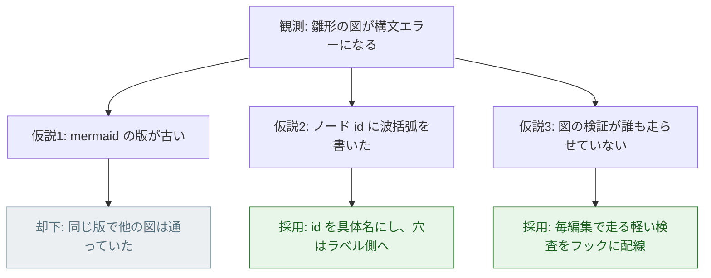
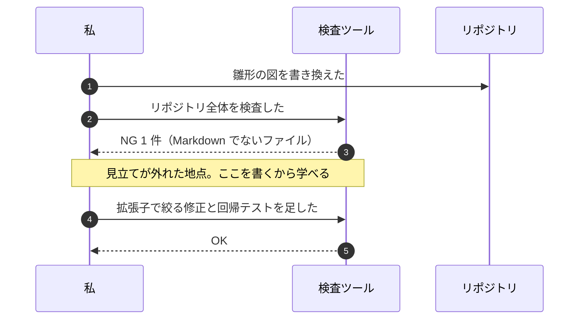
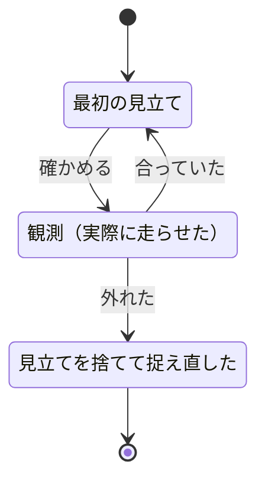

# 思考を記録する（design-journal）

AI に任せると **結論だけが速く出る** 。結論は再利用できるが、
結論に至った過程は再利用できない —— 人は同じ問題を自力で解けるようにならない。

このスキルは、設計と問題解決の途中で何を考えたかを
**人が読んで真似できる形** で残す。目的は記録ではなく **学習** 。

## 設計書の「判断の記録」との違い（別物なので混ぜない）

| | 判断の記録（`docs/design/S##-*.md`） | ジャーナル（このスキル） |
|---|---|---|
| 読者 | 将来この実装に触る人 | **いま学んでいる人** |
| 問い | なぜこの設計なのか | **どうやってその手を思いついたのか** |
| 外した仮説 | 書かない（結論に不要） | **必ず書く。ここが主役** |
| 手戻り | 結果だけ残す | 順番どおりに残す |
| 量 | 3 行〜 | 1〜2 画面 |
| 義務 | **必須** （7 点セットの一部） | **既定 ON・完了条件の外** （下記） |

## 「既定 ON」と「必須」は違う（この区別が命）

| | 既定 ON（このスキル） | 必須（7 点セット） |
|---|---|---|
| 合図が出たら | **聞かずに書く** | 書く |
| ユーザーが「今回は要らない」と言ったら | **書かない** | 書く（拒否できない） |
| 書かなかったとき | 反復は **完了する** | 反復は完了しない |
| `check_deliverables.py` | **対象外** | 対象 |

**ジャーナルは 8 点目の成果物ではない。** 7 点セットは 7 点のまま。
完了条件に入れた瞬間に「埋めるための文章」が書かれ始め、学習資料としては死ぬ。
かといって「書くか聞く」形にすると、忙しい日には毎回スキップされて
1 本も残らない。 **既定 ON はその中間** ——
書くのが既定で、断るのは 1 語で済む。

## いつ書くか（3 つだけ。合図が出たら聞かずに書く）

| 合図 | 具体例 | 誰が書くか |
|---|---|---|
| **判断点で選択肢を出した** | `option-first` を使った直後。設計の分かれ道を通った | 選択肢を出した役（`designer` など） |
| **詰まって抜けた** | 最初の見立てが外れた。2 回以上やり直した | 詰まった役 |
| **節目の操作をした** | PR・マージ・ブランチ整理・リリース・設定の切り替え | 操作した役 |

**選択肢を出した回は、追加の思考が要らない。**
提示した選択肢 → 節 3（考えた道筋の分岐図）、
選ばれなかった案と理由 → 節 4（外した仮説）。 **書き写すだけ** 。
`伴走` モードでは毎反復で合図が出るので、毎反復 1 本たまる。

**うまくいったことだけを書かない。** 一発で通った作業に学びは無い。
書く価値があるのは **外れた地点** と **選ばなかった道** 。

書かなくてよいもの: 手が止まらなかった作業 / 同じ話題のジャーナルが
既にあるもの（追記する）/ 秘密情報を含むもの。

## 置き場所

| 何を | どこに |
|---|---|
| 1 回分の思考（1 エピソード） | `docs/journal/YYYYMMDD-<slug>.md` |
| 操作の記録（累積・引きやすさ優先） | `docs/journal/commands.md` |
| どのプロジェクトでも同じ操作の型 | `.claude/skills/design-journal/git-commands.md`（このスキル同梱） |

`<slug>` は後で思い出せる短い語（`mermaid-broken` `port-or-not`）。
日付は **実際に考えた日** （書いた日ではない）。

## 1 本の構成（6 節。順番を変えない）

順番そのものが問題解決の型を教える。 **雛形は `template.md`** 。

| 節 | 書くこと | なぜこの順か |
|---|---|---|
| 0 | 題名と 1 行の結論 | 一覧から辿ったとき人はここしか読まない |
| 1 | **観測** —— 実際に見たもの（エラー・出力）をそのまま | 解釈より先に事実を置く。ここを飛ばすと思い込みが混ざる |
| 2 | **言い換え** —— 症状 → 本当の問題 | 学習効果が最も大きい節。ここが問題解決の芯 |
| 3 | **考えた道筋** —— 1 枚の図（分岐図） | 文章だと分岐が線状につぶれて追えない |
| 4 | **外した仮説** —— 表で全部 | 後から消したくなる節。消すと学習資料でなくなる |
| 5 | **決めたことと、次に同じ問題が来たときの手順** | 「今回の話」を「次に使える型」に変える |
| 6 | **実行したコマンド** —— 実測 | 読者が同じことを自分の手で再現できる |

節 2 が書けないときは、まだ問題を理解していない。書くのを止めて調べに戻る。

## 図（フローチャートは必須。他は任意で足す）

記法の正は `writing-conventions` の `guides/diagrams.md` 。

| 図 | 記法 | 義務 | 向く回 |
|---|---|---|---|
| **判断の分岐図** | `flowchart TD` | **必須（毎回）** | 思考の流れそのもの。省略できない |
| 時間の流れ図 | `sequenceDiagram` | 任意 | 仮説 → 検証 → 結果を往復した回（デバッグ） |
| 理解の変化図 | `stateDiagram-v2` | 任意 | 見立てが途中で入れ替わった回 |

**思考の流れは必ずフローチャートで表す。** 文章だけのジャーナルを書かない ——
分岐が線状につぶれ、「どこで曲がったか」が消える。文章で読めるなら
それは分岐の無い作業であり、そもそも書く価値のある回ではない。

**採用した枝だけを描かない。** 却下した枝を灰色で残す ——
ジャーナルの図は「正解の構造」ではなく「探索の跡」を見せるためにある。

### 分岐図（このリポジトリで実際に起きた例）



図 1: 判断の分岐図（緑 = 採用、灰 = 却下。却下した枝を消さない）

図 1 では、原因が **2 つ同時にあった** ことが枝の形で分かる
（文章に直すと、この「同時に 2 つ」が落ちる）。
ノード id は ASCII の短い語にする（日本語 id と `{}` は構文エラーになる。
`check_mermaid_ids.ps1` が毎編集で弾く）。

### 時間の流れ図



図 2: 時間の流れ図（実線 = 依頼、破線 = 返り）

図 2 の要点は `Note` を **外れた地点** に置くこと。
何回やり取りしたかではなく、どこで見立てが崩れたかを見せる。

### 理解の変化図



図 3: 理解の変化図（見立てと観測を往復し、外れたときだけ次の状態へ進む）

図 3 の `s2 --> s1` の戻り線が「確かめるまで先へ進まない」ことを表す。

## 人が読めるようにするための決め（読みやすさは装飾ではなく仕様）

学習資料なので、正確さと同じ重さで読みやすさを要求する。

1. **1 文を短く** —— 1 文 60 字程度。「〜であり、〜のため、〜だが」を切る
2. **推測と断定を書き分ける** —— 「〜と思った」「実測では〜だった」を
   混ぜない。 **思考の記録では、間違っていた思考も一級の内容**
3. **専門用語は初出で言い換える** —— 「Port（外部 I/O を差し替えるための
   約束事）」。読者は数か月後の自分でもある
4. **コードは 5 行まで** —— それ以上は `file.py:42` のリンクにする。
   ジャーナルはコードを読ませる場所ではない
5. **時系列を勝手に整えない** —— 実際に行き来したなら行き来したまま書く。
   きれいな一本道に直すと、真似できない手品になる
6. **図は 1 枚 1 主題** —— 分岐と時間を 1 枚に詰めない

## 操作の記録（`docs/journal/commands.md`）

PR・マージ・ブランチ整理のような **節目の操作** は、
思考とは別に累積で残す。次に同じ操作をするとき、そのまま引ける形にする。

1 項目につき、必ず次の 3 点を書く（1 つでも欠けたら引けない記録になる）。

| # | 見出し | 中身 |
|---|---|---|
| 1 | 何をするコマンドか | 1 行。目的を日本語で |
| 2 | 実際に打ったもの | 引数まで省略せず。 **実測の出力を貼る** |
| 3 | 落とし穴 | 詰まった点・環境依存・戻し方 |

**どのプロジェクトでも同じ操作の型** は
`.claude/skills/design-journal/git-commands.md` に入っている
（PR を作る・マージする・ブランチを片づける・既定ブランチを変える）。
まずそれを読み、 **このプロジェクトで実際に打ったもの・詰まったもの** だけを
`docs/journal/commands.md` に足す。

## 手順

### 1. 追記で済まないか確かめる（30 秒）

`docs/journal/` を一覧する。同じ話題があれば新規に作らず、
そのファイルに日付見出しで追記する。話題が散るとどちらも読まれなくなる。

### 2. 雛形をコピーする

`.claude/skills/design-journal/template.md` を
`docs/journal/YYYYMMDD-<slug>.md` として写す。

### 3. 節 1（観測）から書く

**節 0（結論）を先に書かない。** 観測から順に書くと、
自分でも「どこで曲がったか」を思い出せる。結論は最後に上へ書き足す。

### 4. 図を 1 枚描いて検証する

```
powershell -File .claude/tools/check_mermaid_ids.ps1 -Path docs/journal/<file>.md
powershell -File .claude/tools/check_diagrams.ps1 -Path docs/journal/<file>.md
```

上は数ミリ秒（編集のたびにフックも走る）。下は完全な構文検証で
1 ファイル約 5 秒かかるので、書き終えたときに 1 回だけ走らせる。

### 5. 節目の操作があれば `commands.md` に足す

実測の出力を貼る（推測で書かない。絶対ルール 7）。

### 6. コミットする

```
docs: ジャーナル「<題名>」を追加

- docs/journal/<日付>-<slug>.md
- 外した仮説: <1 行>
- 学び: <1 行>
```

## 完了チェックリスト

- [ ] 節 1（観測）に、実際に見た出力がそのまま貼ってある
- [ ] 節 2（言い換え）が 1 行で書けている
- [ ] **節 4（外した仮説）が空でない** —— 空なら書く価値のある回ではない
- [ ] **`flowchart TD` の分岐図が必ず 1 枚ある**（思考の流れは図が正）
- [ ] 図に **却下した枝が灰色で残っている**
- [ ] 図の検証（`check_mermaid_ids.ps1`）が 0
- [ ] 節 6 のコマンドが実測（打っていないものを書いていない）
- [ ] 節 5 に「次に同じ問題が来たときの手順」がある
- [ ] コミットした

## 判断の記録（このスキル自体の設計）

- **採用: 7 点セットの外に置き、 **既定 ON** にした**（2026-08-14 に
  「任意」から変更）—— 理由: 「任意」だと合図が出ても書かれない回が続き、
  学習資料が 1 本もたまらなかった。かといって必須にすると
  `check_deliverables.py` の判定対象になり「埋めるための文章」が始まる。
  **既定 ON（書くのが既定・断るのは 1 語）** が両者の中間で、
  合図が出た回だけという発火条件も保てる
- **却下: 任意のまま `/journal` の案内だけ出す**（変更前の形）
  —— 得られたはずのもの: 完全な自発性。避けたかったこと: 案内は
  「あとで書く」に変換されて消えること。実際 1 本も残らなかった
- **却下: 8 点目の必須成果物にする**
  —— 得られたはずのもの: 記録の網羅性。避けたかったこと: 形骸化と、
  半日で終わるはずの反復が終わらなくなること
- **却下: 設計書の「判断の記録」に統合する**
  —— 得られたはずのもの: 文書が増えないこと。避けたかったこと:
  設計書の読者（将来の実装者）に、学習用の回り道まで読ませること。
  読者が違う文書は分ける
- **却下: 雛形生成ツール（`new_journal.ps1`）を先に作る**
  —— 理由: まだ 1 本も書いていない。索引が要るほどたまってから作る
  （たまったら `index_workshop.ps1` と同じ形で足す）

## やってはいけないこと

- **後から美化する** —— 外した仮説を消す・行き来を一本道に直す。
  このスキルの存在意義そのものを消す行為
- 結論だけ書く（それは設計書の「判断の記録」の仕事）
- 打っていないコマンド・得ていない出力を貼る
- **合図が出ていない回に書く**（一発で通った作業に学びは無い。
  「既定 ON」は合図が出た回の既定であって、全反復で書く指示ではない）
- **合図が出た回に「書きますか？」と聞く**（既定 ON なので聞かずに書く。
  ユーザーが要らないと言ったときだけ書かない）
- 完了条件・チェックリスト（`check_deliverables.py`）に足す
- 秘密情報（トークン・個人情報）を実測の出力ごと貼る
