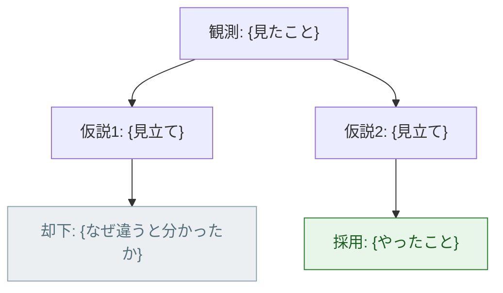

<!--
  思考の記録の雛形（design-journal スキル）。
  docs/journal/YYYYMMDD-<slug>.md にコピーして使う。

  書く順は 1 → 6。節 0（結論）は最後に上へ書き足す。
  節 4（外した仮説）が空になったら、書く価値のある回ではない。
  この HTML コメントごと消してから書き始めること。
-->

# {題名。何に詰まったか / 何を決めたかを 15 字前後で}

- 日付: {YYYY-MM-DD。書いた日ではなく考えた日}
- 対象: {S## / 工房のツール名 / プロセス}
- かかった時間: {30 分・半日など。次に同じ問題が来たときの見積もりになる}

**一言でいうと**: {結論を 1 行。一覧から辿った人はここしか読まない}

## 1. 何を見たか（観測）

{解釈を混ぜず、実際に見たものだけを書く。ここに推測を入れると
 以降の全部が思い込みの上に乗る}

```
{エラーメッセージ・コマンド出力をそのまま貼る。要約しない}
```

## 2. どう捉え直したか（問題の言い換え）

- 最初に見えた症状: {表面。例: 「図が表示されない」}
- **本当の問題**: {言い換えた後。例: 「壊れた図を誰も検査していない」}

{なぜそう言い換えられたのか、手がかりになった事実を 1〜3 行で}

## 3. 考えた道筋



図 1: 判断の分岐図（緑 = 採用、灰 = 却下）

図 1 のとおり {分岐の要点を 1 行}。

> ノード id は ASCII の短い語にする（`observed` `h1`）。
> 雛形の `{}` は必ず `"…"` の中だけに書く —— id に書くと構文エラーになる。
> 時間の往復が主題なら `sequenceDiagram`、見立ての入れ替わりが主題なら
> `stateDiagram-v2` に差し替える（規約は design-journal スキル）。

## 4. 外した仮説（消さない）

| 仮説 | なぜそう思ったか | どう確かめたか | 結果 |
|---|---|---|---|
| {見立て} | {根拠。思い込みでもそのまま書く} | {実際に打った検証} | 外れ |
| {見立て} | {根拠} | {検証} | 当たり |

**この表を消したくなったら、それは残す価値がある証拠。**

## 5. 決めたことと、次に使える手順

- **決めたこと**: {何をどうしたか}
- **理由**: {何を重く見たか}
- **捨てたもの**: {採用によって失ったこと。トレードオフ}

### 次に同じ問題が来たときの手順

1. {まず何を観測するか}
2. {次に何を疑うか}
3. {どう確かめるか}

{ここが「今回の話」を「次に使える型」に変える節。
 手順が書けないなら、まだ一般化できていない。無理に書かず「未一般化」と書く}

## 6. 実行したコマンド（実測）

```
{実際に打ったコマンド}
```

```
{その出力。推測で書かない。長いときは要点の行だけを抜き、抜いたと明記する}
```

{節目の操作（PR・マージ・ブランチ整理）なら、docs/journal/commands.md にも
 「何をするか / 実際に打ったもの / 落とし穴」の 3 点で足す}
