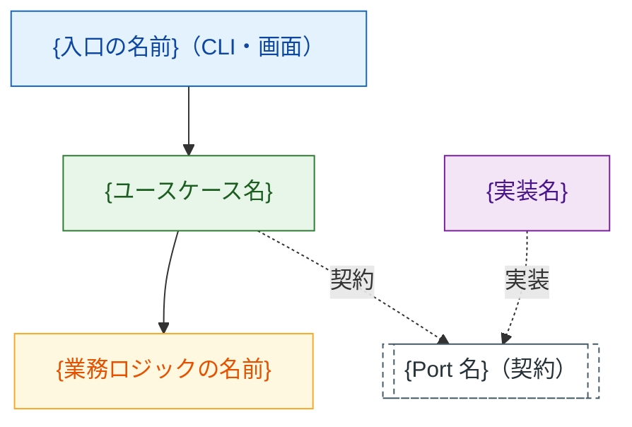
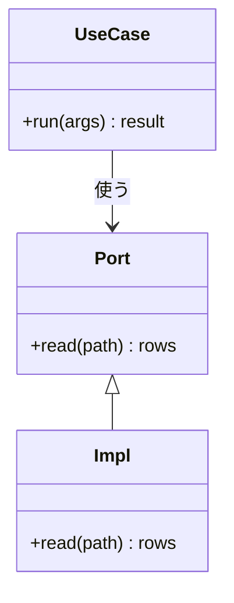
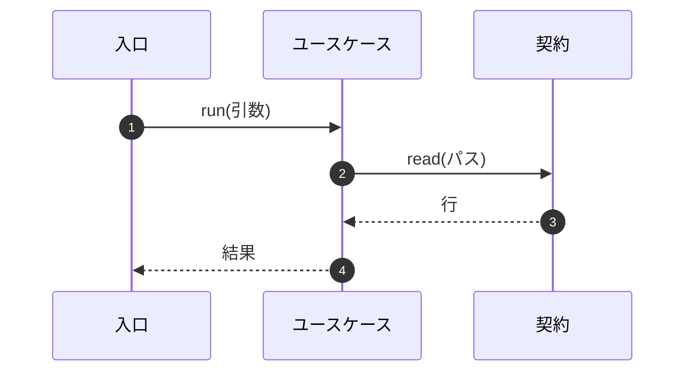
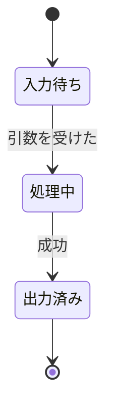

# S##. {スライス名（日本語）}— 設計

**成熟度: `L1 動く`** ｜ 要求: [S##](../usdm/src/S##-{name}.html) ｜
ハブ: [S##](../slices/S##-{name}.md)

> この 1 枚は **毎スライスで必ず書く** （省略も後回しも不可）。
> ただし L1 では下の上限を超えない —— 超えたらスライスが大きすぎる。
> 上限: **4 種の図（1 枚あたりノード 5 個まで）** ＋ 構成 10 行 ＋
> 主張の表 ＋ 判断の記録 3 行。
> **薄くするのは 1 枚あたりであって、枚数ではない**（`functional-design`）。

## 構成（図 1／4・フローチャート）

図 1: {このスライスの構成}（実線 = 直接の依存、破線 = 契約経由）

<!--
  ノード id は「層.モジュール名」（ソースルート相対のモジュールパス。
  拡張子なし）。表示名は日本語。この id 規約があるので、実装から起こした
  図と機械比較できる（diff_arch.py）。略号（A・P）を使うと比較が死ぬ。

  **id の cli / count / rows / csv_reader は例なので実物の名前に置き換える。**
  雛形の `{}` は「"…" の中（表示名）」にだけ書く —— id に `{}` を書くと
  mermaid の構文エラーになる（`check_mermaid_ids.ps1` が編集のたびに検出する）。

  外部 I/O が無いスライスでは Port を消してよい（契約を切らない判断も
  「判断の記録」に書く）。図の色と向きの規約は
  `.claude/skills/writing-conventions/guides/diagrams.md` が正。
  書いたら図検証ツールと乖離の検査を通す:
    powershell -File .claude/tools/check_diagrams.ps1 -Path <このファイル>
    <ツール実行コマンド> .claude/tools/diff_arch.py <ソースルート>
-->

## 何があるか（図 2／4・クラス図）

図 2: 型と契約（`<|--` = 実装・継承、`-->` = 保持・利用）

<!--
  クラス名は実物に置き換える（Port / Impl / UseCase は例）。
  L1 はノード 5 個まで。実装後に逆生成した図と突き合わせる:
    <ツール実行コマンド> .claude/tools/build_uml.py <ソースルート> --kind class
-->

## いつ何を呼ぶか（図 3／4・シーケンス図）

図 3: 入口から出口までの呼び出し順（実線 = 呼ぶ、破線 = 返る）

## どんな状態を通るか（図 4／4・状態遷移図）

図 4: 状態と遷移

<!--
  **状態が無いスライスでもこの図を省かない。** `[*] --> 完了` の
  2 状態でよい ——「状態を持たない」という設計判断を図で示すことに意味がある
  （後で状態が増えたとき、増えたことが図の差分で分かる）。
  この図だけは実装から逆生成できない（build_uml.py --kind state は拒否する）。
  代わりに、ここに書いた状態名が実装の列挙型・定数にあるかを人が確かめる。
-->

## 主張（契約式）

> **結論の散文ではなく、検証できる主張を書く。**
> 記法と考え方の正は `.claude/skills/verifiable-claims/SKILL.md`。
> 表の列と順序を変えない（`build_claims.py` がこの形で読む）。

| ID | 種別 | 主張 | assert | 状態 | 根拠 |
|---|---|---|---|---|---|
| P1 | 事前 | `{呼ぶ側が守ること}` | `assert {同じ内容}` | ⊬ | 未 |
| Q1 | 事後 | `∀x ∈ out. {保証}` | `assert all({同じ内容} for x in out)` | ⊬ | 未 |
| I1 | 不変 | `{前後で変わらないこと}` | `assert {同じ内容}` | ⊬ | 未 |

**場合**: `{入力} = ∅ ⊔ {場合B} ⊔ {場合C}`（`⊔` は排他かつ網羅）

**反例**: Q1 が破れるなら —— {どんな値が 1 つあれば破れるか}

<!--
  設計の段では状態は ⊬（未証明）で始まる。テストが緑になった段で
  ⊢ に変え、根拠列にテスト名を入れる（⊢ を根拠なしで書かない）。
  ⊬ のまま残るものは docs/backlog.md の負債表にも 1 行足す。
  事後条件は 1 行 1 主張。健全性（余計を出さない）と完全性（取りこぼさない）
  を 1 行に潰さない —— 片方だけ壊れるバグが最も多い。
-->

## 構成の詳細（10 行以内）

図 1 の各ノードを、実物のパスと入口の名前に落とす。

- 入口: `{関数・メソッド}({引数})` → `{次に呼ぶもの}`
- 流れ: {入力 → … → 観測できる出力}
- presentation: `{パス}`（{役割}）
- application: `{パス}`（{ユースケース名}。契約 `{Port 名}` をここに置く）
- domain: `{パス}`（{純粋な計算・判定}）
- infrastructure: `{パス}`（`{Port 名}` の実装）
- 配線: `{どこで実装を選ぶか}`
- テストの差し替え: `{フェイク実装の置き場所}`
- データの形: {受け渡す値の形。無ければ「素の値のみ」}
- 仮実装: {L1 で手を抜く箇所。無ければ「なし」}

## 判断の記録

> **結論だけ書かない。** なぜそう考えたか・他に何があったか・
> それぞれのメリットとデメリットを残す（`agile-process/deliverables.md`）。

- **採用**: {決めたこと}。**そう考えた理由**: {何を重く見たか}
- **他の選択肢**: {案B} ／ {案C}（検討していないなら「検討していない」と書く）
- **メリット / デメリット**: 採用案 = {得たもの} / {捨てたもの}。
  案B = {得られたはずのもの} / {避けたかったもの}

<!--
  スライスを越えて効く判断（アーキテクチャ・保存形式・外部依存の採用）は
  ここではなく docs/decisions/ADR-###-<name>.md に 1 枚で書く。
-->

## L2 で足すもの（着手時は空でよい）

- 失敗時の扱い: {想定内の失敗をどう返すか}
- 契約の一覧: {このスライスが持つ Port とその実装}
- 図の肉付け: {4 枚それぞれに失敗経路と境界を足す。 **枚数は増えない** }
- 主張: {事後条件を全部 `⊢` にする。場合分けを `⊔` で閉じ切る}
