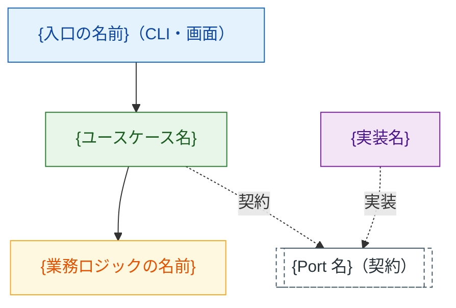

# S##. {スライス名（日本語）}— 設計

**成熟度: `L1 動く`** ｜ 要求: [S##](../usdm/src/S##-{name}.html) ｜
ハブ: [S##](../slices/S##-{name}.md)

> この 1 枚は **毎スライスで必ず書く** （省略も後回しも不可）。
> ただし L1 では下の上限を超えない —— 超えたらスライスが大きすぎる。
> 上限: 図を 1 枚 ＋ 構成 10 行 ＋ 判断の記録 3 行。

## 構成

図 1: {このスライスの構成}（実線 = 直接の依存、破線 = 契約経由）

<!--
  ノード id は「層.モジュール名」（ソースルート相対のモジュールパス。
  拡張子なし）。表示名は日本語。この id 規約があるので、実装から起こした
  図と機械比較できる（diff_arch.py）。略号（A・P）を使うと比較が死ぬ。

  **id の cli / count / rows / csv_reader は例なので実物の名前に置き換える。**
  雛形の `{}` は「"…" の中（表示名）」にだけ書く —— id に `{}` を書くと
  mermaid の構文エラーになる（`check_mermaid_ids.ps1` が編集のたびに検出する）。

  外部 I/O が無いスライスでは Port を消してよい（契約を切らない判断も
  「判断の記録」に書く）。図の色と向きの規約は
  `.claude/skills/writing-conventions/guides/diagrams.md` が正。
  書いたら図検証ツールと乖離の検査を通す:
    powershell -File .claude/tools/check_diagrams.ps1 -Path <このファイル>
    <ツール実行コマンド> .claude/tools/diff_arch.py <ソースルート>
-->

## 構成の詳細（10 行以内）

図 1 の各ノードを、実物のパスと入口の名前に落とす。

- 入口: `{関数・メソッド}({引数})` → `{次に呼ぶもの}`
- 流れ: {入力 → … → 観測できる出力}
- presentation: `{パス}`（{役割}）
- application: `{パス}`（{ユースケース名}。契約 `{Port 名}` をここに置く）
- domain: `{パス}`（{純粋な計算・判定}）
- infrastructure: `{パス}`（`{Port 名}` の実装）
- 配線: `{どこで実装を選ぶか}`
- テストの差し替え: `{フェイク実装の置き場所}`
- データの形: {受け渡す値の形。無ければ「素の値のみ」}
- 仮実装: {L1 で手を抜く箇所。無ければ「なし」}

## 判断の記録

> **結論だけ書かない。** なぜそう考えたか・他に何があったか・
> それぞれのメリットとデメリットを残す（`agile-process/deliverables.md`）。

- **採用**: {決めたこと}。**そう考えた理由**: {何を重く見たか}
- **他の選択肢**: {案B} ／ {案C}（検討していないなら「検討していない」と書く）
- **メリット / デメリット**: 採用案 = {得たもの} / {捨てたもの}。
  案B = {得られたはずのもの} / {避けたかったもの}

<!--
  スライスを越えて効く判断（アーキテクチャ・保存形式・外部依存の採用）は
  ここではなく docs/decisions/ADR-###-<name>.md に 1 枚で書く。
-->

## L2 で足すもの（着手時は空でよい）

- 失敗時の扱い: {想定内の失敗をどう返すか}
- 契約の一覧: {このスライスが持つ Port とその実装}
- 主経路の図: {シーケンス図・状態遷移図のどちらを足すか}
