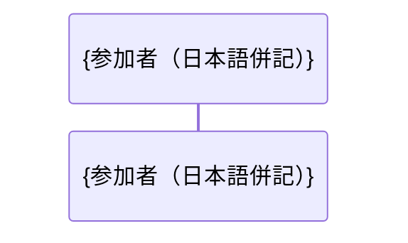

# S##. {スライス名（日本語）}— 設計（厚い経路）

**🔧 設計済み・未実装**。要求仕様: [S##](../../requirements/S##-<name>.md)。
依存: [S##](S##-<name>.md)（{依存理由}。無ければ「依存なし」）。

## 目的

{何をできるようにするか・なぜ必要かを2〜4文で。要求仕様書の
「ユーザー価値」を実装可能な言葉に落とす}

## 仕様の充足方針

要求仕様書に書かれた仕様を、どの設計要素が満たすかの対応表。

| 仕様 | 満たす設計要素 | 検証方法（単体 / 統合） |
|---|---|---|
| {条件1} | `{クラス・メソッド}` | {単体テスト観点 N / 統合テスト} |

## 位置づけ（レイヤー配置）

| 追加/変更 | 層 | ファイル |
|---|---|---|
| `{クラス名}`（新規契約） | domain | `{パス}` |
| `{クラス名}`（新規） | infrastructure | `{パス}` |
| {変更点} | {配線箇所（あれば）} | `{パス}` |

## 新規契約とクラス

{契約（インタフェース）のシグネチャをコードブロックで。構造が複雑なら
クラス図、やり取りが本質ならシーケンス図（Mermaid・日本語 note 併記）で示す}

```
{言語に応じた契約定義。メソッド名・引数名は実装でそのまま使う精度で}
```



## 既存変更点（最小限）

- `{既存クラス}`: {変更内容。後方互換の取り方（引数追加はデフォルト値付き等）}
- **{core クラス群} は無変更**（変更しないものを明示する）

## テスト観点

> 実装（TDD）はここをテストコードに翻訳するところから始まる。

1. {純粋部分の単体テスト観点（境界値・失敗経路・冪等性を含める）}
2. {結合の観点（フェイク注入で透過性を確認等）}
3. {配線の観点（未注入時に従来どおり動く後方互換の確認）}

## 設計上の決定と却下案

| 決定 | 理由 |
|---|---|
| {採用した設計} | {なぜ。設計の型（core 無変更・共有状態注入等）との関係} |
| （却下）{検討したが捨てた案} | {なぜ捨てたか。リスク・波及コスト} |

## 既知の制限

- {v1 で許容する制限と、問題化したときの解決の方向}
