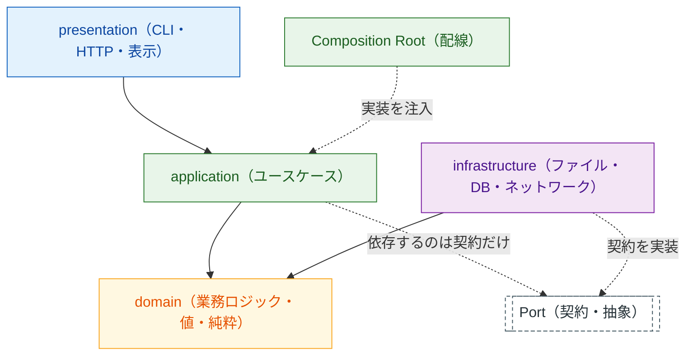

# クリーンアーキテクチャ（layered-architecture）

このプロジェクトの構造は **レイヤードアーキテクチャ + 依存性逆転** 。
外側（入出力・外部 I/O）を内側（業務ロジック）から切り離し、
**内側が外側を知らない** 状態を保つ。目的は疎結合そのものではなく、

- **テストが速く安定する**（外部 I/O をフェイクに差し替えられる）
- **外側の変更が内側を壊さない**（保存先・表示先を替えても業務ロジックは無傷）

の 2 つ。この 2 つが得られない抽象化は作らない（先回りの抽象化は禁止）。

## 層と依存の向き



凡例: 実線 = 直接の依存（import）、破線 = 契約を介した依存、
角丸の二重枠 = 契約（Port）。色は層（青 = presentation / 緑 = application /
黄 = domain / 紫 = infrastructure）。

具体的なパスはプロファイルの「層構成」表を正とする。

| 層 | 役割 | import してよいもの |
|---|---|---|
| presentation | 入出力・表示・CLI・HTTP ハンドラ | 標準ライブラリ + application + domain |
| application | ユースケース・進行の組み立て・ **契約（Port）の定義** | 標準ライブラリ + domain |
| domain | 業務ロジック・値・計算（純粋） | **標準ライブラリのみ** |
| infrastructure | 外部 I/O の実装（契約の実装側） | 標準ライブラリ + domain + application の契約 + 許可された外部ライブラリ |
| Composition Root | 実装を選んで注入する **配線 1 か所** | すべて（ここだけが全部を知ってよい） |

## 2 つのルール

覚えるのはこれだけ。

> 1. **内向きの依存だけ** —— 外側が内側を import する。逆はしない。同じ層内で循環しない
> 2. **外部 I/O は契約を介す** —— application は infrastructure を直接 import しない。
>    契約を application 側に置き、実装を infrastructure に置き、
>    Composition Root で注入する

- `domain` が `application` を import → 違反（逆流）
- `application` が `infrastructure` を import → **違反**（契約経由にする）
- `infrastructure` が `application` の契約を import → **違反ではない**
  （実装が契約を知るのは内向き）
- `presentation` が `infrastructure` を import → 違反（配線は Composition Root）

この 2 つを機械検証する（アーキテクチャテスト）。
検証コマンドはプロファイルの「アーキテクチャテスト」を使う。

## 契約（Port）の切り方

**外部の世界に触るものだけ** 契約にする。切りすぎると読みにくくなる。

| 対象 | 契約にするか |
|---|---|
| ファイル・DB・ネットワーク・時刻・乱数・プロセス起動・環境変数 | **する**（テストで差し替えたいもの） |
| 純粋な計算・変換・判定 | しない（domain に置けば済む） |
| 実装が 1 つしか無く、外部にも触らない部品 | しない（後で必要になったら切る） |

契約の形（言語に読み替える。命名はプロファイルの「命名規則」に従う）:

```
application/ports.py       # 契約: CsvReader.read(path) -> list[str]
infrastructure/csv_file.py # 実装: LocalCsvReader（ファイルから読む）
test/fakes.py              # 実装: FakeCsvReader（メモリ上の行を返す）
presentation/cli.py        # 配線: LocalCsvReader を注入して use case を呼ぶ
```

**契約は使う側（application）に置く。** 実装側に置くと依存が逆さになり、
実装を差し替えるたびに application が壊れる。

## 成熟度に応じた守り方

| 成熟度 | 層と契約の扱い |
|---|---|
| **L1 動く** | **4 層に分ける** （1 層 1 ファイルでよい）。外部 I/O があるスライスだけ契約を 1 本切って注入する。無ければ切らない。仮実装・ハードコードは可（負債に記録） |
| **L2 固い** | 外部 I/O はすべて契約経由。配線が Composition Root 1 か所に集まっている |
| **L3 整った** | 逆流ゼロ・循環ゼロ。アーキテクチャテストが緑。契約にフェイク実装があり domain / application のテストが外部 I/O に触らない |

**L1 でも層は分ける。** 以前の「L1 は 1 ファイルでよい」は廃止した。
理由: 通した後で層に割り直す作業（テストごと書き直しになる）のほうが、
最初から 4 ファイルに分けるより高くつくため。 **分けるのは安い。
契約を切るのは高い** ので、契約だけを必要最小限にする。

骨組み（`/skeleton`）でも 4 層 + 契約 1 本を通す。これが以降の全反復が
載る土台になる。

## 置き場所の決め方（上から順に問い、最初に該当した層へ）

1. **標準ライブラリ以外に依存しない計算・値・判定か？** → domain
2. **外部（ファイル・DB・ネットワーク・OS・プロセス）に触るか？** →
   infrastructure（＋ application に契約を 1 本足す）
3. **複数の部品を順に呼んで 1 つの仕事を成立させるか？** → application
4. **利用者に見せる・利用者から受け取るか？** → presentation
5. **どの実装を使うか選んでいるか？** → Composition Root

迷う典型例:

- **入力を受け取る実装** → presentation（I/O が無いなら infrastructure）
- **設定の読み込み** → infrastructure（読んだ値を使う判断は domain）
- **ログ出力** → infrastructure（何を記録するか決めるのは application）
- **時刻・乱数** → 契約にする（固定できないテストは不安定になる）
- **どの層にも見えないもの** → domain に置けないか先に疑う。
  それでも駄目なら application。 **`utils/` は作らない**
  （作ると全部そこへ流れ込み、層の意味が消える）

## テストの置き場所

- テストルートはソースの構成をミラーする
- 統合テスト（E2E）はプロファイルの「統合テスト」パスに分ける
- **domain・application のテストは契約のフェイクを使う**
  （実ファイル・実ネットワークに触らない。ここが遅いと反復が遅くなる）
- infrastructure のテストだけが本物の I/O に触ってよい
  （一時ディレクトリ・フェイクサーバを使い、本物の外部サービスは叩かない）
- フェイク実装はテストルートに置く（本番コードに混ぜない）

## 疎結合をやりすぎないための歯止め

疎結合は目的ではなく手段。次はすべて **禁止** 。

- 実装が 1 つしか無く、外部 I/O にも触らないものに契約を切る
- 契約が実装 1 つと 1 対 1 で、メソッド名まで同じ（意味の無い中間層）
- domain の値オブジェクトごとにインタフェースを作る
- DI コンテナ・プラグイン機構を骨組みの前に導入する

**症状が出ていないのに抽象化しない。** 判断に迷ったら、
契約を切らずに書いて設計書の「判断の記録」に
「ここは契約にしなかった。理由 = 差し替える相手がいない」と残す。

## 家風パターンとの関係

プロファイルの「家風パターン」に `core 無変更` がある場合、その対象は
**L3 に到達したファイルだけ** 。L1・L2 のファイルは自由に書き換えてよい。
凍結対象は `.claude/core_files.txt` に列挙し、L3 到達時に追加する。
