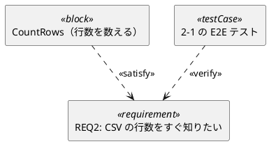

# 図の記法（作図言語）

**アスキーアートによる作図を禁止する。** ずれる・検証できない・
差分が読めないため、図は必ず作図言語で書く。

## 使う作図言語

図の種類ごとに 表 1 の記法を使う。迷ったら Mermaid を選ぶ
（Markdown 上で直接レンダリングされ、最も摩擦が少ない）。

表 1: 図の種類と使う作図言語

| 図の種類 | 記法 | フェンス |
|---|---|---|
| クラス図 | Mermaid `classDiagram` | ` ```mermaid ` |
| コンポーネント図 | Mermaid `flowchart` | ` ```mermaid ` |
| アクティビティ図 | Mermaid `flowchart TD` | ` ```mermaid ` |
| シーケンス図 | Mermaid `sequenceDiagram` | ` ```mermaid ` |
| 状態遷移図 | Mermaid `stateDiagram-v2` | ` ```mermaid ` |
| 層と依存の向き（依存グラフ） | Mermaid `flowchart TD` ＋ `classDef` で層を色分け | ` ```mermaid ` |
| ER 図 | Mermaid `erDiagram` | ` ```mermaid ` |
| 結線・経路の配置を細かく制御したい図（ブロック線図・データフロー図） | Graphviz (dot) | ` ```dot ` |
| UML のうち Mermaid に無いもの（配置図・パッケージ図・ユースケース図） | PlantUML | ` ```plantuml ` |
| **SysML**（要求図・ブロック定義図 bdd・内部ブロック図 ibd） | PlantUML（ステレオタイプで表す） | ` ```plantuml ` |

**細かい配置制御に Graphviz を使う理由** —— 分岐点・合流点・
フィードバック経路の配置を `rankdir` と `constraint` で制御でき、
Mermaid では表現しきれない図が書けるため。

**SysML を使う場面** —— 要求と設計要素の対応（`<<satisfy>>` /
`<<verify>>`）を図で示したいとき。要求番号（`REQ2`）と仕様番号（`2-1`）を
そのままノード名に使い、要求 → 設計要素 → テストの線を 1 枚で見せる。
L3 の `docs/design.md` で使う（L1・L2 では過剰）。



## 日本語を必ず併記する

認知負荷を下げるため、図は日本語で読めるようにする。

- **ノードのラベルは日本語で書く** 。英語の識別子を使う場合は
  日本語の意味を必ず併記する（ `UserRepository（利用者リポジトリ）` ）
- **信号線・遷移のラベルにも日本語を書く**
  （ `検索条件` `検索結果の一覧` ）
- 物理量には単位を併記する（ `経過時間 dt_s [s]` ）
- 図の意図が一目で分からない箇所には、作図言語のコメント機能で
  補足を入れる（Mermaid は `%%`、Graphviz と PlantUML は `//` ）

## 番号・キャプション・検証

- 図には番号とキャプションを付け、本文から 図 n の形で参照する
  （書式は `guides/numbering.md`）
- **図を書いたり修正したりしたら、必ず図検証ツールを実行する**
  （手作業でのブロック抽出は禁止 —— エンコーディング事故のもと）

```
powershell -File .claude/tools/check_diagrams.ps1 -Path <file.md>
powershell -File .claude/tools/check_diagrams.ps1 -Path docs
```

このツールは Mermaid / PlantUML / Graphviz の 3 言語すべてを
それぞれのツールチェーンで検証する。NG が出たまま作業を完了としない。

> `check_mermaid.ps1` は Mermaid 専用の旧ツール。新規の検証は
> `check_diagrams.ps1` を使う。

## 見た目の規約（読みやすさは装飾ではなく仕様）

図は「あれば良い」ものではなく、 **構造を一目で伝えられて初めて価値がある** 。
次の 6 つを守る。

1. **層で色を分ける** —— クリーンアーキテクチャの 4 層は常に同じ色にする。
   プロジェクト内で色の意味を揺らさない（色が意味を持つ）

   ```mermaid
   flowchart TD
     presentation.cli["CLI（入口）"] --> application.count["カウントのユースケース"]
     application.count --> domain.rows["行数の数え方（純粋）"]
     application.count -.->|契約| application.ports[["CsvReader（契約）"]]
     infrastructure.csv_reader["ファイル読み（実装）"] -.->|実装| application.ports
     classDef presentation fill:#e3f2fd,stroke:#1565c0,color:#0d47a1
     classDef application fill:#e8f5e9,stroke:#2e7d32,color:#1b5e20
     classDef domain fill:#fff8e1,stroke:#f9a825,color:#e65100
     classDef infrastructure fill:#f3e5f5,stroke:#7b1fa2,color:#4a148c
     classDef port fill:#ffffff,stroke:#455a64,stroke-dasharray:4 3,color:#263238
     class presentation.cli presentation
     class application.count application
     class domain.rows domain
     class infrastructure.csv_reader infrastructure
     class application.ports port
   ```

2. **ノード id はモジュールパス、表示名は日本語** ——
   id は **ソースルート相対のモジュールパス**（`application.count`。拡張子なし・
   区切りは `.`）、`[...]` の中は人が読む日本語にする。
   この規約があるおかげで、実装から起こした図と **機械的に比較できる**
   （`architecture-drift` スキル・`diff_arch.py`）。
   id に日本語や `A` `P` のような略号を使うと比較できず、乖離の検出が死ぬ

3. **依存の向きを上から下に固定する** —— `flowchart TD` を使い、
   矢印は必ず下向き。逆流があると図が上を向くので、 **図が違反を可視化する**
4. **契約（Port）は破線と角丸で描く** —— 実装と契約が一目で区別できること
   （上の例の `application.ports`）。「どこで疎結合にしたか」が図の主題
5. **凡例を付ける** —— 色・線種の意味を図の直後に 1 行で書く。
   凡例の無い色分けは読者に推測を強いる
6. **1 枚 1 主題** —— 「層」「主経路」「状態」を 1 枚に詰めない。
   詰めたくなったら、それは 2 枚に分ける合図

## 設計書に最低限入れる図（成熟度別・省略禁止）

図は L3 の贅沢品ではない。 **L1 の薄い設計書にも 1 枚必須** 。
文章 10 行より、正しい 1 枚のほうが速く読めて誤解が少ないため。

| 成熟度 | 設計書（`docs/design/S##-*.md`）に入れる図 |
|---|---|
| **L1 動く** | **1 枚**: 層と依存の向きを示す `flowchart TD`（契約があれば破線で示す） |
| **L2 固い** | ＋ **1 枚**: 主経路を示す図（シーケンス図・状態遷移図・データフロー図から対象に合うもの） |
| **L3 整った** | 上記を `docs/design.md` へ統合し、クラス図（契約と実装の関係）と SysML の要求図（要求 → 設計要素 → テスト）を足す |

厚い経路（`docs/design/proposals/S##-*.md`）は最初から L2 の 2 枚を入れる。

## 工房レーンでの扱い

`workshop/` 配下では図は任意。ただし **描くならアスキーアートは禁止**
（この 1 点だけは工房でも必須）。番号とキャプションは、図が 2 枚以上に
なったときに付ける。
